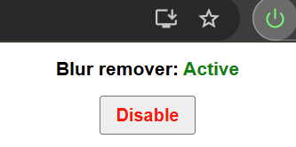

# Songsterr Warning Remover

Removes unwanted blur, ads and warning elements from [songsterr.com](https://www.songsterr.com) for a cleaner, distraction-free experience.

## Features

-   Instantly removes blur overlays, ads and warning popups.
-   Toggle the extension on/off from the popup.
-   Works automatically and observes dynamic page changes.

## Install

1. **Download or Clone this repo**

    [Download with this link](https://github.com/arthur-adriansens/songsterrWarningRemover/archive/refs/heads/main.zip), or clone with this command:

    ```sh
    git clone https://github.com/arthur-adriansens/songsterrWarningRemover.git
    ```

2. **Load into Chrome**

    - Go to `chrome://extensions`
    - Enable "Developer mode"
    - Click "Load unpacked" and select the (zip) folder

3. **Enjoy a cleaner Songsterr!**

    Everything will work automatically when you view a tab on Songsterr!

4. **Optional: click the extension icon**
    - Use the popup to enable/disable blur removal.

## License

This project is licensed under the Creative Commons Attribution-NonCommercial 4.0 International License.  
Commercial use is **not allowed without written permission**.

Zie [LICENSE](./LICENSE) voor meer details.

## Screenshots

>  > _Popup UI: Toggle blur remover_

---

**Enjoy a cleaner Songsterr!**
